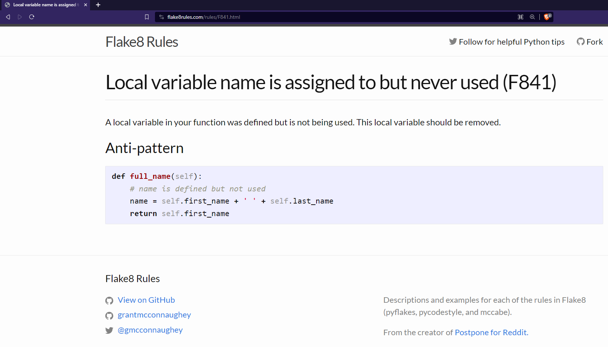
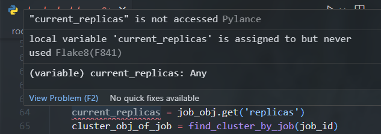

# Contributor Python Code Style Guide

The most important shared understanding should be that spending additional time on high-quality and easily comprehensable/readable code is absolutely worth it and crucial for success in software engineering.

Recommended read:

https://bayrhammer-klaus.medium.com/you-spend-much-more-time-reading-code-than-writing-code-bc953376fe19

Besides that, having and enforcing a common code style guide helps the team to stick to and create high quality code that is uniform, thus easier to get used to (onboarding) and comprehend. We want to help and make life easier for our individual team members and not enforce/punish them during their work.

We want to follow industry standarts and not reinvent the wheel, thus we stick to **PEP 8** (https://peps.python.org/pep-0008/)

To be able to follow this code style easier we utilize the following established production grade tools:

- **Black** formatter (https://github.com/psf/black) - syntax
- **Flake8** linter (https://flake8.pycqa.org/en/latest/) - semantics
- **isort** (https://github.com/PyCQA/isort) - import sorter

We will quickly demonstrate how to install, use, and automate them in your terminal and IDE. For concrete use-case examples please have a look at the respective documentations, there you will find many examples.

## *Black*
### Installation
`pip install black`

### Terminal Usage
You need to specify the files/directories black should run on.  
Black can target a single file or the entire root directory.

On default Black will automatically try and resolve/adjust the target files.

`black --line-length 100 .`

If you do not want to adjust the files but only see what black would change use the following command:

`black --line-length 100 --check --diff --color .`

*Note: The default line-length for these tools is below 100, from experience 100 is more developer-friendly*

### Automating Black in VSCode
These changes will allow you to apply Black formatting automatically every time you safe your changes.
1) Download the official (from Microsoft) "Black Formatter" extension.
2) Open your VSCode Settings
3) Activate "Editor: Format On Save"
4) Select "Black Formatter" for "Editor: Default Formatter"

## *Flake8*
Flake provides concrete custom errorcodes for found issues.
Feel free to look them up online to properly understand how to fix them. E.g. for the issue code F841

### Installation
`pip install flake8`

### Terminal Usage
Using flake8 is very similar to using Black.
Unlike Black however, flake8 cannot fix its found issues on its own because semantics are a lot more complex than syntax.

Base command:

`flake8 --max-line-length=100 .`

### Enabling flake8 highlighting in VSCode
As already mentioned flake8 sadly cannot fix our logical issues for us, however it can point them out directly in the code by highlighting possible mistakes and when you hover over them it will point to a concrete so-called flake-error that can be looked up online to figure out how to fix it.

Install the official (from Microsoft) "Flake8" extension.

## *isort*
### Installation
`pip install isort`

### Terminal Usage
isort behaves very similar to Black. It can automatically perform adjustments or run in "check-only" mode.

To use isort to adjust files simply run this:

`isort .`

You can run the following to check what isort would change:

`isort --check-only --diff --color .`

### Automating isort in VSCode
Similar to Black's extension the official (Microsoft) "isort" extension will automatically sort all your imports when you safe a file.
