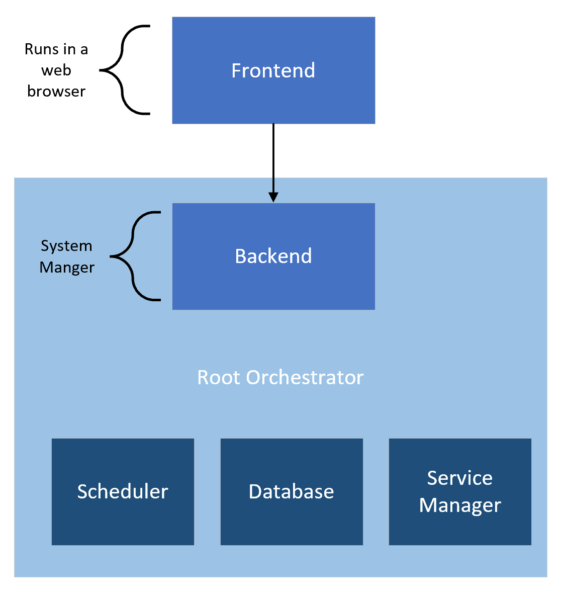

# Architecture

**IMPORTANT:** It reflects only the structure as of the current version and may not reflect the structure of
future versions.

EdgeIO Dashboard project consists of two main components. They are called here the
frontend and the backend.

The frontend is a single page web application that runs in a browser. It fetches all its
business data from the backend using standard HTTP methods. It does not implement business logic,
it only presents fetched data and sends requests to the backend for actions.

The backend is the extended version of the Root Orchestrator, especially the System Manager.
It can run anywhere as long the frontend can access the System Manager. 
The figure below outlines the architecture of the project:

## Backend

- Written in [Python](https://www.python.org).
- Code is stored in the `edgeio` repository.
  - currently only the develop-frontend branch supports the user interface

## Frontend

- Written in [TypeScript](https://www.typescriptlang.org/).
- Using [Angular](https://angular.io/) along with [Angular Material](https://material.angular.io/) for components like cards, buttons etc.
- Code is stored in `src/app/` directory.
- Frontend makes calls to the API and renders received data. It also transforms some data on the client and provides visualizations for the user.
