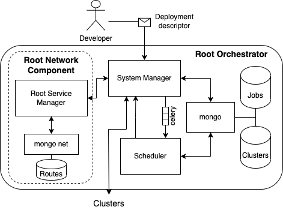

# Table of content

- [Root Orchestrator](#root-orchestrator)
- [Cluster Orchestrator](#cluster-orchestrator)
- [Worker Node](#worker-node)

# Oakestra Detailed Architecture

As shown in our [Get Started](get-started.md) guide, Oakestra uses 3-4 building blocks to operate. 

* Root Orchestrator
* Cluster Orchestrator
* Node Engine
* NetManager (optional)

This section of the wiki is intended for people willing to contribute to the project and it is meant to describe some internal architectural details. 

## Root Orchestrator

The Root Orchestrator is a centralized control plane that is aware of the participating clusters.

This picture describes the containers that compose the Root Orchestrator. As you may have seen we use docker-compose to bring up the orchestrators. This is because each block of this picture is *currently* a separated container. 

- The System Manager is the point of contact for users, developers, or operators to use the system as an application deployment platform. It exposes APIs to receive deployment commands from users (application management) and APIs to handle slave Cluster Orchestrators. Cluster Orchestrators send their information
regularly, and the System Manager is aware of those clusters.
- The scheduler calculates a placement for a given application within the available clusters.
-  Mongo is the interface we use to access the database. We store aggregated information about the participating clusters. We differentiate between static metadata and dynamic data. The former covers the IP address, port number, name, and location of each cluster. The latter can be data that is
changing regularly, such as the number of worker nodes per cluster, total amount of CPU cores and memory size, total amount of disk space, GPU capabilities, etc.
-  The Root Network Components are detailed in the Oakestra-Net Wiki. 

### System Manager APIs

TODO

### Jobs DB Structure

TODO

### Clusters DB Structure

TODO

### Scheduler Algorithms

TODO

### Consideration regarding failure and scalability:

The main problem of a centralized control plane is that it can act as a single point of failure. By design without a Root Orchestrator, the clusters are able to satisfy the SLA for the deployed applications internally, the only affected functionalities are the deployment of new services and the intra-cluster migrations. To avoid failure and increase resiliency an idea is to make the component able to scale by introducing a load balancer in front of the replicated components. However, this feature is not implemented yet.

## Cluster Orchestrator

TODO

### Cluster Manager APIs

TODO

### MQTT Topics

TODO

### Jobs DB structure

TODO

### Nodes DB structure

TODO

### Schedulers Algorithms

TODO

## Worker Node

TODO

